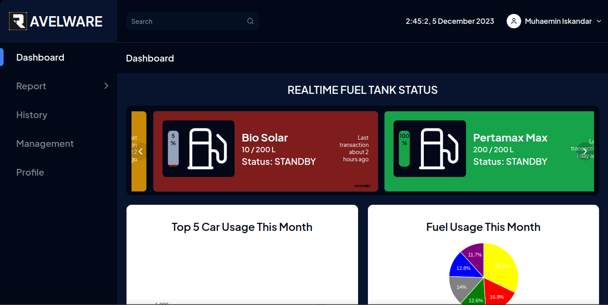

  <h1>Ravelware Dashboard</h1>
  
Realtime dasboard site using MQTT arch

 

## Screenshots
> 

## Project Goals
I build this site as follow technical test of [Ravelware](https://www.ravelware.co). This site is a dashboard site for monitoring and controlling IoT devices. This site is built using MQTT arch, so it can be used for real-time monitoring and controlling.

## Tech Stack
- [Next.js](https://nextjs.org/) - App router
- [Tailwind CSS](https://tailwindcss.com/)
- [MQTT](https://www.npmjs.com/package/mqtt)
- [Radix UI](https://www.radix-ui.com/)
- [Shadcn](https://ui.shadcn.com)
- [Zustand](https://docs.pmnd.rs/)
- [Google charts](https://react-google-charts.com/)
- [react-day-picker](https://react-day-picker.js.org/)
- etc

## Features
- [x] Realtime monitoring graph
- [x] Table data
- [x] Loading/Streaming
- [x] 404 page
- [x] Local storage state
- [x] Date picker

## Requirements
You can read the requirements [here](./docs/fe-test-ravelware.pdf)

